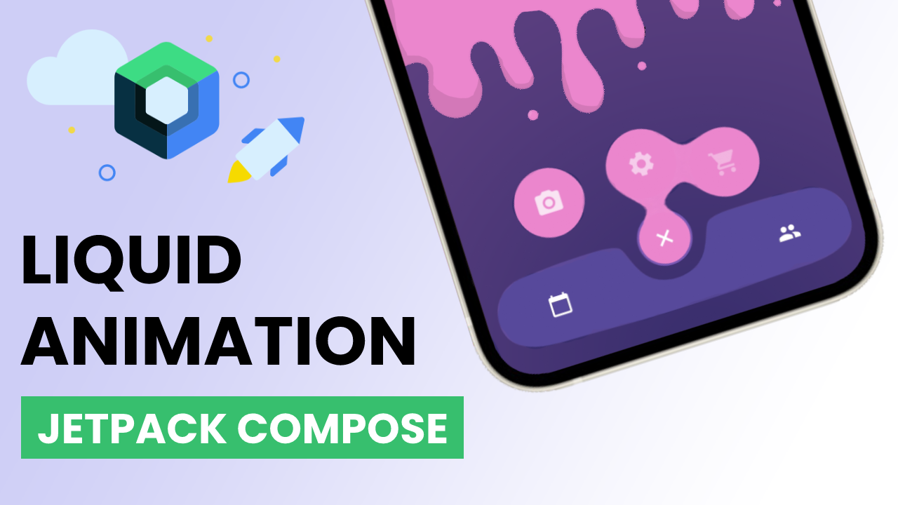

# Liquid Bottom Navigation UI Design in Jetpack Compose

## [Watch it on YouTube](https://youtu.be/nP42CBV5Rd0)

This is a concept of Android Bottom Navigation using RenderEffect. RenderEffect is available since Android 12. In this tutorial, I'm using `BlurEffect` and `ColorFilterEffect` to mimic liquid-like behavior which I found on the Internet.

### Preview

